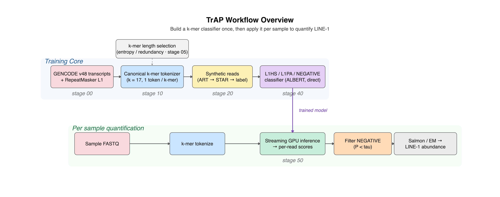

# TrAP — A Transformers Analysis Pipeline for Genome LINE-1 Content

[](https://www.python.org/)
[](https://github.com/psf/black)
[](LICENSE)

**TrAP** treats DNA as language to detect and quantify **LINE-1 (L1)** retroelements in
short- and long-read RNA-seq data. Where conventional tools (RepeatMasker, alignment)
struggle to resolve novel or divergent insertions and to separate segmental duplications
from true L1 copies, TrAP takes an **alignment-free** route: reads are split into k-mers,
tokenized, and classified by a custom **ALBERT** transformer that learns the nucleotide
distribution of L1 sequences directly.

The pipeline produces a per-read label — **`L1HS`**, **`L1PA`**, or **`NEGATIVE`** — and
feeds the read-level classifier into abundance estimators (ALBERT + Salmon, ALBERT + EM)
for transposable-element quantification against RepeatMasker annotations on GRCh38.p14.

> [!NOTE]
> This README is the single entry point for the whole project. Deep, stage-specific docs
> live alongside their code — most importantly **[`scripts/slurm/README.md`](scripts/slurm/README.md)**
> for the HPC reproduction pipeline. The methodology mirrors the manuscript
> (*A Transformers Analysis Pipeline to Evaluate Genome LINE-1 Sequence Content*); terms
> such as ALBERT, MLM + SOP, k-mer entropy, SentencePiece coverage, and 5′RACE validation
> are used here with the same meaning.

## Key features

- **Alignment-free L1 detection** — no reference mapping required at inference time.
- **k-mer language model** — sequences split into overlapping k-mers (default **k=17**,
  the entropy/redundancy plateau observed above k=16) and tokenized with **SentencePiece**
  (32k vocabulary ≈ 10% of all 17-mers, achieving full transcriptome coverage).
- **Custom ALBERT** — masked-language pretraining (MLM + SOP) followed by sequence
  classification, using factorized embeddings to stay lightweight.
- **Reproducible by construction** — global seeding, per-run `manifest.json` (git commit,
  seed, input SHA-256s, throughput), and fully offline HF execution on HPC.
- **Scales on SLURM** — multi-GPU training via HuggingFace Accelerate and an
  `sbatch --dependency=afterok` chain for the TAMU Grace cluster.

## Getting started

### Prerequisites

- **Python 3.12.2** (strict, `~=3.12.2`)
- **Conda/Anaconda** for environment management
- A CUDA-capable multi-GPU node for training/quantification (CPU/MPS works for smoke tests)

### Install

```bash
git clone https://github.com/andchamorro/TrAP.git
cd TrAP

bash scripts/setup_conda_env.sh   # creates env, editable install, registers kernels
conda activate trap
```

The setup script does three things:
1. Creates the `trap` conda environment from `envs/environment.yml`.
2. Installs TrAP in editable mode (`pip install -e .`) from the repo root.
3. Registers a **Python kernel** (`Python (trap)`) and an **R kernel** (`R (trap)`) into
   your user-level Jupyter kernel directory (`~/.local/share/jupyter/kernels/`), and
   installs the R packages used by the analysis notebooks (`data.table`, `ggplot2`,
   `jsonlite`, `reshape2`).

> [!IMPORTANT]
> Do **not** run `conda env create -f envs/environment.yml` directly — conda resolves
> `-e .` relative to the YAML file's location (`envs/`), not the repo root, causing
> the install to fail. The setup script handles this by running `pip install -e .`
> from the correct directory after env creation.
>
> For the dev environment: `bash scripts/setup_conda_env.sh --dev`
> To update an existing env: `bash scripts/setup_conda_env.sh --update`

> [!NOTE]
> `jupyterlab` and `notebook` are **not** installed in the `trap` env. Run Jupyter from
> your base conda environment; the kernels registered above will appear automatically.

## The pipeline

TrAP has **two tracks**. A *build* track (run once, offline on SLURM) trains the
classifier; an *apply* track quantifies a sample with it. The k-mer tokenizer is shared by
both, and every stage writes a `manifest.json` (git commit, seed, input SHA-256s). Each CLI
is a Typer app invokable with `python -m <module> <command> --help`.

<p align="center">
  
</p>

<sub>Rendered by [`scripts/R/workflow_overview.R`](scripts/R/workflow_overview.R). The classifier is trained **directly** on the supervised task — there is no MLM pre-training stage.</sub>

### 1. Gather references & build the labeled dataset

Download GENCODE v48 transcripts, the GRCh38.p14 genome and GTF, and build STAR/BWA
indexes:

```bash
bash scripts/data/fetch_references.sh
```

Generate the synthetic, labeled training corpus. Reads are simulated with **ART**
(Illumina, 5× coverage, 150 bp reads, 500 bp mean fragment, 10 bp SD), aligned with
**STAR** (high multi-mapping for repeat-aware placement), then labeled by intersecting
alignments with **RepeatMasker** L1 annotations (`scripts/divide_gff.py` splits the GFF
per subfamily; `bedtools` assigns `L1HS` / `L1PA` / `NEGATIVE`):

```bash
bash scripts/build_dataset.sh
```

> [!TIP]
> Dataset parameters live in [`config/datasets/l1hs_l1pa2_v48_k17.yaml`](config/datasets/l1hs_l1pa2_v48_k17.yaml).
> Set `SKIP_BUILD=1` to reuse existing FASTQ and run only the preprocessing steps.

### 2. Train the tokenizer

Train a SentencePiece Unigram k-mer tokenizer and wrap it as a HuggingFace
`PreTrainedTokenizerFast`:

```bash
python -m trap.loaders.tokenizer train \
    --corpus data/external/gencode.v48.transcripts.fa.gz \
    --out models --name tokenizer.gencode.v48.k17.32k \
    --k 17 --vocab-size 32000
```

### 3. Preprocess into HuggingFace datasets

Tokenize and split. The **classification** dataset uses a **transcript-level split** so no
transcript contributes reads to more than one split (prevents read-level leakage); the
**masking** dataset is the chunked MLM corpus.

```bash
# Classification (paired reads, transcript-level split)
python -m trap.utils.preprocessing_sequences classification \
    --pretrained-model-path models/tokenizer.gencode.v48.k17.32k \
    --builder data/external/l1_R1.fq --pair data/external/l1_R2.fq \
    --k 17 --split-strategy transcript-level

# Masked-language-model corpus
python -m trap.utils.preprocessing_sequences masking \
    --pretrained-model-path models/tokenizer.gencode.v48.k17.32k \
    --builder data/external/gencode.v48.transcripts.fa.gz --k 17
```

### 4. Train the model

Three sub-commands: `masking` (MLM pretraining, minimizes MLM + SOP loss, monitored by
masked-token accuracy/perplexity), `classification` (fine-tune `AlbertForSequenceClassification`),
and `distiller` (knowledge distillation). Configs are JSON in [`config/training/`](config/training);
models are saved to `models/<name>/final/`.

```bash
# MLM pretraining
python -m trap.modeling.train masking albert.gencode.v48.k17.32k \
    --pretrained-tokenizer-path models/tokenizer.gencode.v48.k17.32k \
    --albert-config-path config/albert_config_k17_v48.json \
    --trainer-config-path config/training/mlm.json --k 17

# Classification fine-tuning on the MLM checkpoint
python -m trap.modeling.train classification albert.l1hs_l1pa2.v48.k17.32k \
    --pretrained-model-path albert.gencode.v48.k17.32k \
    --trainer-config-path config/training/classification_final.json --k 17 --do-eval
```

For multi-GPU, wrap with Accelerate: `accelerate launch -m trap.modeling.train ...`.

> [!TIP]
> **Smoke-test before a long run.** MLM pretraining is a multi-day job, and a bad
> config (e.g. a fine-tuning learning rate used for from-scratch training) can train
> for hours while learning *nothing*. A fast pre-flight gate trains on a 1k-row subset
> and fails unless the loss drops below the uniform-random baseline `ln(vocab)`:
>
> ```bash
> # ~2 s, CPU, no data needed — proves the training code can reduce loss
> pytest tests/modeling/test_smoke_training.py -v
>
> # ~10 min, 1 GPU — validates the real config on real data (HPC)
> sbatch scripts/slurm/24_mlm_smoke.slurm            # gates MLM pretraining
> sbatch scripts/slurm/34_classification_smoke.slurm # gates classification
> ```
>
> On the SLURM pipeline these gates run automatically before the expensive stages;
> a failed gate stops the chain. See [`scripts/slurm/README.md`](scripts/slurm/README.md#pre-flight-smoke-gates-24_mlm_smoke-34_classification_smoke).

### 5. (Optional) Tune hyperparameters

Hyperparameter search uses **Optuna + Hyperband** (`Trainer.hyperparameter_search`),
optimizing the same objectives as the manuscript — validation MLM loss for pretraining and
`eval_f1` for classification. This replaces the original Ray Tune / Population-Based
Training recipe with a lighter, fully offline, seeded engine; search spaces live in
[`config/tuning/`](config/tuning).

```bash
# Local sweep (writes config/training/classification_final.tuned.json)
python -m trap.modeling.tune classification albert.l1hs_l1pa2.v48.k17.32k \
    --search-config config/tuning/classification_optuna.yaml \
    --preprocessing-name gencode.v48.k17.32k/l1hs_l1pa2 \
    --pretrained-model-path albert.gencode.v48.k17.32k
```

The winning `*.tuned.json` is then passed as `--trainer-config-path` to stage 4.

### 6. Quantify a sample

Stream paired FASTQ through the classifier to produce per-read class scores, then filter
reads by their `NEGATIVE`-class score before downstream abundance estimation (Salmon/EM):

```bash
# GPU batch classification (Accelerate PartialState, rank-aware sharding)
python -m trap.modeling.quantify run \
    --pretrained-model-name albert.l1hs_l1pa2.v48.k17.32k \
    --r1 sample_R1.fastq.gz --r2 sample_R2.fastq.gz \
    --output-path reports/quantify/sample --k 17 --batch-size 64

# Keep reads with L1 presence (low NEGATIVE score)
python -m trap.modeling.postprocessing filter-ids \
    --fastq sample_R1.fastq.gz --output-path reports/quantify/sample --threshold 0.5
```

> [!NOTE]
> Quantification reports aggregate logit scores per L1 element/read; in the manuscript these
> aggregate to chromosome-level distributions that correlate with 5′RACE long-read references
> (R² = 0.91 for the ALBERT + Salmon pipeline) and with BWA alignment counts (r = 0.93 for L1HS).

### 7. Validate end-to-end (synthetic abundance benchmark)

A ground-truth benchmark for the full **filter → salmon** pipeline: full-length L1 elements
are inserted into chr1 GENCODE transcripts at known levels, reads are simulated with ART, and
each method's recovered per-locus abundance is regressed (R²) against the known truth. The
**generation** step (run once, on a compute node — needs `art_illumina`, `seqkit`, `bedtools`,
`samtools`, `salmon`, BioPython) sources everything from `data/external`:

```bash
# Inputs: GRCh38.p14.genome.fa.gz, GCF_..._rm.LINE1.promoter.bed (full-length L1 ≈6 kb),
# gencode.v48.transcripts.fa.gz (+ gencode GTF for the chr1 subset).
# SLURM array (prep job → per-cell array, afterok, resumable):
bash scripts/slurm/submit_generate_synthetic.sh      # → data/ref/...chr1.withdel/ (art/, *.bed, l1_synthetic.Index)
# or sequentially on one node:
#   source scripts/slurm/_common.sh && load_bio_modules && activate_trap
#   module load SeqKit/2.9.0 && bash scripts/sh/generate_synthetic_dataset.sh
```

The grid is insertion level 2⁵–2¹³ × deletion probability {0–0.1} (45 samples), inserts are
**deterministic** (fixed `--seed`, so the dataset is reproducible). Then run the classifier
**filter → salmon** path per sample and compute the comparison (see
**[`.trap/plans/synthetic-e2e-validation.md`](.trap/plans/synthetic-e2e-validation.md)**):

```bash
# one sample:
POWER=8 DELPROB=0.025 sbatch scripts/slurm/synthetic_validation.slurm
# or the full grid as a per-cell SLURM array:
bash scripts/slurm/submit_synthetic_validation.sh
```

> [!NOTE]
> The legacy generator set no random seed, so this re-creation is a **new, seeded draw**; compare
> methods at the **R²-vs-Simulated** level (stable across draws). Figures migrate to R/ggplot
> (notebook `5.02`, consuming `results/synthetic_validation/*.csv`). See
> [`docs/guides/synthetic_validation.md`](docs/guides/synthetic_validation.md).

## Reproduce on HPC (Grace)

The full chain is orchestrated as SLURM jobs. See **[`scripts/slurm/README.md`](scripts/slurm/README.md)**
for the complete guide (per-stage scripts, GPU overrides, account setup, tuning sweeps).

```bash
python -m trap.reproduce stages                  # list pipeline stages
bash scripts/slurm/submit_pipeline.sh --dry-run  # preview the sbatch chain
bash scripts/slurm/submit_pipeline.sh            # submit 00 → 50 (afterok chain)
bash scripts/slurm/submit_tuning.sh              # optional Optuna sweeps
```

## Project structure

```
trap/                 # Python package
├── config/           # path constants, pydantic schemas, manifest writer
├── loaders/          # GenomeDataset, SentencePiece/WordPiece tokenizer
├── modeling/         # train, tune, predict, quantify, postprocessing, ALBERT
└── utils/            # kmer, io, dna2bit, preprocessing_sequences, seeding
config/               # albert_config_*, training/, tuning/, datasets/ (JSON + YAML)
scripts/              # bash entry points; scripts/slurm/ for the HPC pipeline
tests/                # pytest suite mirroring trap/ (markers: unit, integration, slow)
manuscript/  docs/  notebooks/  reports/
```

> [!IMPORTANT]
> Always import path constants from `trap.config.config` (`MODELS_DIR`, `PROCESSED_DATA_DIR`, …)
> and reuse the canonical utilities (`GenomeDataset`, `kmer_split`, `try_mkdir`) rather than
> reconstructing them.

## Configuration

| Path | Purpose |
|---|---|
| `config/albert_config_k17_v48.json` | ALBERT architecture (k=17, vocab 32k, max position 1280) |
| `config/training/{mlm,classification_final}.json` | `TrainingArguments` (seed 3469, bf16) |
| `config/tuning/{mlm,classification}_optuna.yaml` | Optuna search spaces |
| `config/datasets/l1hs_l1pa2_v48_k17.yaml` | ART/STAR/split parameters |

Training and quantification run **offline**: `HF_DATASETS_OFFLINE=1`,
`TRANSFORMERS_OFFLINE=1`, `TOKENIZERS_PARALLELISM=false` (set automatically by the SLURM
scripts). The default reproducibility seed is **3469**.

## Verbosity

Every CLI command accepts a `--verbosity` flag (default `off`). Set it once per
invocation or export `TRAP_VERBOSITY` for the whole session:

```bash
export TRAP_VERBOSITY=normal   # stage progress for all commands in this shell
python -m trap.modeling.train masking ...         # picks up env var
python -m trap.loaders.tokenizer train ... --verbosity detailed  # override per command
```

| Level | What you see |
|---|---|
| `off` *(default)* | Completion messages (`SUCCESS`), warnings, and errors only — minimal noise on HPC. |
| `normal` | + Stage start/end notifications, elapsed time, record counts, key metrics, and device info. |
| `detailed` | + Full operational info (per-substep progress, dataset dimensions, subsample decisions, model-selection details) — all `logger.info()` output, no debug-level noise. |

**Expected output for `--verbosity normal`** (tokenizer training):

```
2026-05-31 12:00:00 | STAGE   | [tokenizer:train] algorithm=unigram k=17 vocab_size=32,000
2026-05-31 12:00:00 | STAGE   | [tokenizer:train] corpus loaded — 87,324 sequences
2026-05-31 12:00:00 | STAGE   | [tokenizer:train] training started — 87,324 seqs
2026-05-31 12:00:42 | STAGE   | [tokenizer:train] done — elapsed=42.1 s → models/tokenizer.gencode.v48.k17.32k
2026-05-31 12:00:42 | SUCCESS | Tokenizer + manifest written to models/tokenizer.gencode.v48.k17.32k
```

**Expected output for `--verbosity off`** (default):

```
2026-05-31 12:00:42 | SUCCESS | Tokenizer + manifest written to models/tokenizer.gencode.v48.k17.32k
```

The verbosity level can also be set in any config file (`TokenizerConfigSchema`,
`TrainerConfigSchema`, `DatasetBuildSchema`, `QuantifyConfigSchema`) via a `verbosity` field.
The `TRAP_VERBOSITY` environment variable takes precedence at module import; the `--verbosity`
flag on the CLI overrides everything at call time.

## Development

```bash
make lint                 # flake8 + isort --check + black --check (line length 99)
make format               # black
pytest                    # full suite
pytest -m "not slow"      # skip slow tests
pytest --cov=trap         # with coverage
```

Tests mirror the `trap/` package under `tests/` and use the markers `unit`, `integration`,
and `slow`. Logging is **loguru** only; CLIs follow the Typer `app = typer.Typer()` pattern
with `pathlib.Path` parameters.

## Citation

If you use TrAP, please cite the manuscript *A Transformers Analysis Pipeline to Evaluate
Genome LINE-1 Sequence Content* (Chamorro-Parejo et al.). See [`manuscript/`](manuscript).
